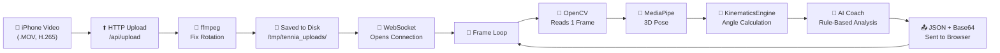
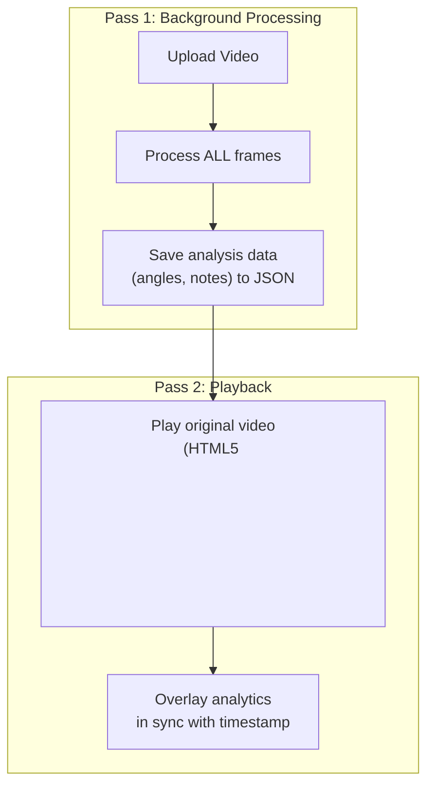

# Tennia Architecture Deep Dive
## How It Works, Where It Stands, and How to Reach Real-Time

---

## 1. How Your Current System Works (Step by Step)

Here's exactly what happens when you press "Upload Video":



### Step 1: Upload & Pre-processing
- **Library**: `ffmpeg` (command-line video tool)
- **What it does**: Your iPhone records in H.265 (HEVC) codec with EXIF rotation metadata. OpenCV ignores this metadata, so the video appears sideways. `ffmpeg` re-encodes the video to H.264, baking the rotation into the actual pixels.
- **Time**: ~2-5 seconds for a 10-second clip
- **Storage**: Creates a second copy of the video on disk (~5-15 MB per clip)

### Step 2: Frame-by-Frame Reading
- **Library**: `OpenCV` (`cv2.VideoCapture`)
- **What it does**: Opens the video file and reads one frame at a time using `cap.read()`. Each call returns a single BGR image as a NumPy array.
- **Current setting**: Processes every **2nd frame** (skips 1) to save compute. For a 30fps video, this means ~15 frames/second are actually analyzed.
- **Memory per frame**: A 720×1280 frame = `720 × 1280 × 3 bytes` = **~2.8 MB** in RAM (uncompressed)

### Step 3: MediaPipe 3D Pose Estimation
- **Library**: `mediapipe` by Google (v0.10+)
- **Model**: MediaPipe Pose Landmarker (BlazePose)
- **Architecture**: Two-stage neural network:
  1. **Detector** — Locates the person bounding box (runs once, then tracks)
  2. **Landmark model** — Predicts 33 body keypoints in 3D (x, y, z + visibility)
- **Model Complexity**: Currently set to `1` (balanced). Options are:
  - `0` = Lite (~15ms/frame, least accurate)
  - `1` = Full (~30-50ms/frame, good accuracy) ← **current**
  - `2` = Heavy (~80-120ms/frame, best accuracy)
- **Backend**: Runs on **CPU only** via TensorFlow Lite with XNNPACK delegate. Does NOT use GPU on macOS.
- **Output**: 33 landmarks, each with `(x, y, z, visibility)` in normalized coordinates

### Step 4: Kinematics Engine
- **Library**: `numpy` (pure math, no ML)
- **What it does**: Takes the 33 3D landmarks and calculates joint angles using vector math:
  - For each joint (knee, elbow, shoulder, hip): takes 3 landmarks, computes the angle between the two vectors meeting at the vertex
  - Tracks angular velocity by comparing angles between consecutive frames
- **Time**: < 1ms per frame (negligible)

### Step 5: AI Coach (Rule-Based)
- **Library**: Pure Python (no ML model)
- **What it does**: Compares each joint angle against biomechanical reference ranges. If a joint is outside the optimal range, it generates a coaching note with the specific flaw, biomechanical impact, and corrective drill.
- **Time**: < 0.1ms per frame (negligible)
- **No LLM is called** unless you set `GEMINI_API_KEY`

### Step 6: Encoding & Transmission
- **Library**: OpenCV (`cv2.imencode`) + Python `base64`
- **What it does**:
  1. Compresses the annotated frame as JPEG (quality=60) → ~30-50 KB
  2. Base64-encodes it (adds 33% overhead) → ~40-65 KB
  3. Wraps everything in a JSON object with angles, velocities, and notes
  4. Sends over WebSocket to the browser
- **Bandwidth**: For 15 processed frames/second × ~50 KB = **~750 KB/s** (~6 Mbps)
- **Total for a 9-second clip**: ~275 frames → 138 processed → ~7 MB transferred

---

## 2. Resource Consumption Analysis

| Resource | Current Usage | Notes |
|----------|--------------|-------|
| **CPU** | ~80-120% of 1 core | MediaPipe is single-threaded on CPU |
| **RAM** | ~400-600 MB | MediaPipe model (~100MB) + OpenCV buffers + Python overhead |
| **GPU** | **Not used** | MediaPipe on macOS doesn't use Metal/GPU |
| **Disk** | ~10-30 MB per video | Original + ffmpeg-fixed copy |
| **Network (WS)** | ~6 Mbps | Base64 JPEG frames + JSON overhead |
| **Processing Speed** | ~15-20 fps | With frame skipping & model_complexity=1 |

### Why It Feels Slow
The bottleneck is **sequential processing**. The pipeline does this for EVERY frame:
```
Read frame → MediaPipe (30ms) → Math (1ms) → JPEG encode (5ms) → Base64 (3ms) → JSON serialize (2ms) → WebSocket send (5ms)
```
Total: **~46ms per frame = ~22 fps maximum**. But with the WebSocket round-trip and JavaScript rendering, the effective rate drops to **~15 fps**.

---

## 3. Qualisys vs. Tennia — Fundamentally Different Systems

### Qualisys (Marker-Based Optical Motion Capture)

| Aspect | Qualisys | Tennia (Current) |
|--------|----------|-----------------|
| **Method** | Infrared cameras + reflective markers on body | Single RGB camera + AI pose estimation |
| **Cameras** | 8-24 synchronized IR cameras ($5K-15K each) | 1 iPhone camera ($0) |
| **Accuracy** | **Sub-millimeter** (0.1-0.5mm) | **~2-5cm** typical error |
| **Frame Rate** | 120-2000+ fps | 30 fps (iPhone), processed at 15 fps |
| **Latency** | <5ms (true real-time) | ~50-100ms per frame |
| **Setup** | Dedicated room, markers glued on body, calibration | Just point and shoot |
| **Cost** | **$50,000 – $250,000+** | **$0** (open-source) |
| **Markers Required** | Yes (20-50 reflective markers on body) | No (markerless) |

### How Qualisys Achieves Real-Time
1. **Dedicated hardware**: Each camera has its own FPGA that detects marker positions in hardware at nanosecond speed
2. **Triangulation, not AI**: With 8+ cameras seeing the same marker, they compute the 3D position via stereo triangulation — pure geometry, no neural network needed
3. **No video encoding**: They never encode/decode video frames. They only transmit marker coordinates (just numbers)
4. **Specialized software**: Their Qualisys Track Manager (QTM) runs on high-end workstations with real-time OS scheduling

> [!IMPORTANT]
> Qualisys is the "gold standard" for biomechanics research but is impractical for consumer use. No athlete will glue 50 markers on their body for a training session. This is where markerless AI systems like ours have a market opportunity — **convenience at the cost of accuracy**.

---

## 4. Is the AI Accurate?

### Joint Angle Accuracy

**MediaPipe Pose accuracy** (from Google's published benchmarks):
- **2D keypoint error**: ~5-10 pixels on a 720p frame
- **3D depth (Z-axis) error**: ~5-15% of the person's body scale
- **Joint angle error**: **±5-15°** depending on the joint and camera angle

For comparison:
| System | Joint Angle Accuracy | Cost |
|--------|---------------------|------|
| Qualisys (marker) | ±0.5° | $100K+ |
| Vicon (marker) | ±1° | $150K+ |
| MediaPipe (our system) | ±5-15° | $0 |
| OpenPose | ±8-20° | $0 |

### Where MediaPipe Struggles
1. **Self-occlusion**: When limbs overlap (e.g., arm behind body during backswing), the model guesses
2. **Depth estimation**: The Z-coordinate from a single camera is inherently ambiguous — the model hallucinates depth
3. **Fast motion**: At 30fps, a fast tennis serve has significant motion blur
4. **Camera angle**: Side views are much better than head-on or behind views

### The Rule-Based Coach Accuracy
The AI Coach rules are based on sports science literature, but they have limitations:
- The reference ranges are **static** — they don't account for the phase of the stroke (preparation vs. contact vs. follow-through)
- A knee at 155° during a volley is fine, but during a groundstroke it's a flaw — the system doesn't distinguish
- It cannot detect **timing** issues (e.g., hip-shoulder separation timing, which requires tracking angular velocity peaks across a swing sequence)

---

## 5. What Would It Take to Go Real-Time?

### Tier 1: Real-Time Video Playback (No Lag) — Achievable Now

Instead of the current frame-by-frame stream, we can switch to a **two-pass architecture**:



**How this works**:
1. User uploads video → backend processes it entirely in the background (takes ~10-20 seconds for a 10-second clip)
2. Once done, the frontend plays the **original video** natively (using HTML5 `<video>` tag — smooth, no lag, full fps)
3. The analytics data (angles, notes, skeleton overlay) is synced to the video timeline
4. **Result**: Buttery smooth playback with analytics overlaid

> [!TIP]
> This is how **SwingVision**, **Hudl**, and **CoachNow** work. They never stream frame-by-frame — they process in the background and then overlay.

### Tier 2: Real-Time Live Camera Feed — Hard, Needs GPU

To process a **live camera stream** with no lag:

| Requirement | Solution | Cost |
|------------|----------|------|
| 30+ fps pose estimation | Run MediaPipe on **GPU** via ONNX Runtime or TensorRT | Need NVIDIA GPU ($500-3000) |
| Low latency (<33ms/frame) | Skip base64/JSON entirely, use WebRTC for video + separate data channel | Engineering effort |
| Edge deployment | Run the model on the device (phone/tablet) directly | MediaPipe supports this natively on iOS/Android |
| Multi-camera 3D | Two synchronized cameras + stereo triangulation | Need calibration + sync hardware |

### Tier 3: Qualisys-Level Accuracy (Sub-millimeter) — Extremely Hard

This requires **entirely different technology**:
- Multi-camera infrared systems with hardware sync
- Or: **AI models trained on motion capture ground truth** (e.g., HuMoR, SMPL-X body model)
- Cost: $50K+ in hardware OR significant ML research investment

---

## 6. Recommended Next Step: Two-Pass Architecture

> [!IMPORTANT]
> The single most impactful improvement is switching from frame-by-frame streaming to a **two-pass system**. This eliminates all perceived lag, makes the video player smooth, and is how every successful sports analytics product works.

**What changes**:
1. Backend processes the video entirely → saves a `.json` sidecar file with per-frame analytics
2. Frontend plays the original `.mp4` video natively
3. A transparent canvas overlay draws the skeleton and angles in sync
4. AI notes are generated post-processing and displayed in the sidebar
5. The video plays at **full native fps** with zero lag

This is the architectural shift that transforms Tennia from a "tech demo" into an actual product.
