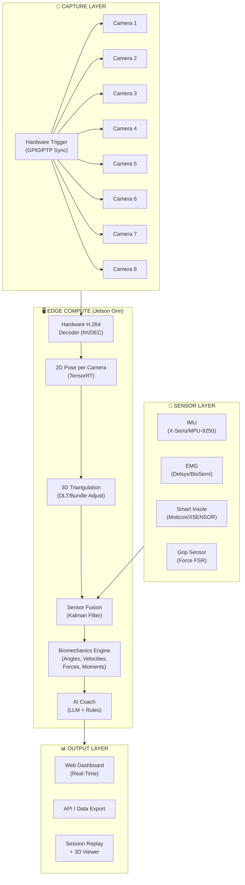
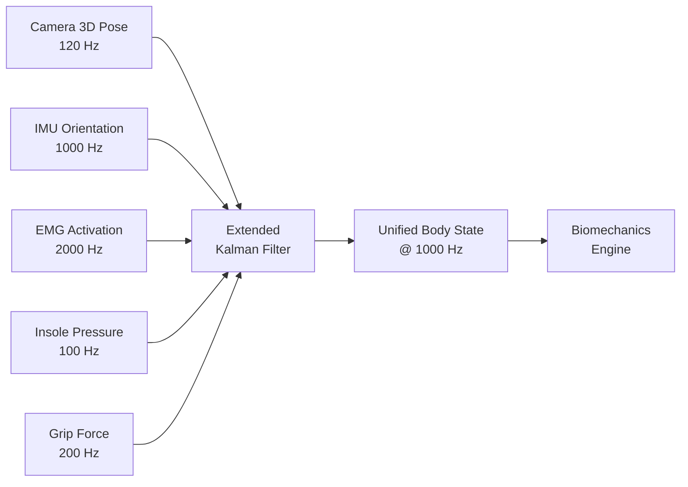

# Tennia — Full System Architecture Roadmap
## From Single iPhone to 8-Camera Sub-Millimeter Motion Capture + Sensor Fusion

---

## 1. The Full Vision (What You're Building)



---

## 2. Multi-Camera Synchronization — The Hardest Problem

### Why Sync Matters

A tennis serve at peak velocity moves the racket head at **~200 km/h** (55 m/s). At that speed:
- A **1ms timing error** between cameras = **5.5 cm** of positional error
- A **100μs timing error** = **5.5 mm** of error
- To achieve **sub-millimeter**, you need **<20μs** sync between all 8 cameras

### How Qualisys/Vicon Solve This

They use **hardware trigger synchronization**:
1. A master clock generates a pulse signal (e.g., every 1/240th of a second for 240 fps)
2. This pulse is sent via a physical cable (BNC/GPIO) to every camera simultaneously
3. Every camera exposes its sensor at the **exact same microsecond**
4. All frames are guaranteed to represent the same instant in time

### How You'll Do It (3 Options, Cheapest to Most Expensive)

#### Option A: Software Sync via PTP/IEEE 1588 (~$200-500)
- **Precision: ~50-200μs** (good for ±1cm accuracy)
- Use GigE Vision cameras (e.g., FLIR Blackfly S, ~$300-500 each) that support PTP
- All cameras connect to a **PTP-capable Ethernet switch** 
- The switch acts as the grandmaster clock, synchronizing all cameras over the network
- **Pros**: No custom hardware, standard protocol, cameras are affordable
- **Cons**: ~100μs jitter is achievable but not sub-millisecond guaranteed

#### Option B: Hardware Trigger via GPIO (~$500-1000)
- **Precision: <10μs** (good for ±0.5mm accuracy)
- Use machine vision cameras with GPIO trigger input (FLIR, Basler, Allied Vision)
- Build or buy a trigger box that sends a simultaneous pulse to all 8 cameras
- The NVIDIA Jetson Orin's GPIO pins can generate this trigger signal
- **Pros**: Deterministic timing, simple circuit
- **Cons**: Need to run physical cables to each camera

#### Option C: Hybrid PTP + Hardware Trigger (~$1000-2000)
- **Precision: <5μs** (sub-millimeter capable)
- PTP for coarse sync + hardware trigger for fine sync
- This is what professional systems use
- **Best accuracy**, most complex setup

### Recommended Camera Hardware

| Camera | Resolution | FPS | Interface | Trigger | Price |
|--------|-----------|-----|-----------|---------|-------|
| FLIR Blackfly S BFS-U3-16S2C | 1440×1080 | 226 fps | USB3 | GPIO | ~$400 |
| Basler ace 2 a2A1920-51gc | 1920×1200 | 51 fps | GigE | PTP + GPIO | ~$350 |
| Allied Vision Alvium 1800 | 1920×1200 | 86 fps | USB3/CSI | GPIO | ~$500 |
| FLIR Blackfly S GigE | 1440×1080 | 120 fps | GigE | PTP + GPIO | ~$550 |

> [!TIP]
> **Start with 4 cameras first**, not 8. A 4-camera setup at 90° intervals gives you full 360° coverage with fewer sync/calibration headaches. Add 4 more later for redundancy and occlusion handling.

---

## 3. Camera Calibration & 3D Triangulation

### Step 1: Intrinsic Calibration (Per Camera)
Every camera lens has distortion. You need to model it:
1. Print a **checkerboard pattern** (8×6 or similar)
2. Capture 20-30 images of the checkerboard from different angles per camera
3. Use `cv2.calibrateCamera()` to compute:
   - **Camera matrix** (focal length, principal point)
   - **Distortion coefficients** (radial + tangential)
4. Save these parameters — they only change if you physically move the lens

### Step 2: Extrinsic Calibration (Camera-to-Camera)
You need to know where each camera is in 3D space relative to each other:
1. Place a **calibration wand** (two bright markers at a known distance) in the capture volume
2. Wave it around so all cameras can see it
3. Use **bundle adjustment** (SciPy or OpenCV's `cv2.solvePnP`) to compute each camera's rotation + translation in a shared world coordinate system
4. This gives you the **projection matrix** for each camera: `P = K × [R | t]`

### Step 3: 2D → 3D Triangulation

Once you have 2D keypoint detections from N cameras and each camera's projection matrix:

```
For each body keypoint (e.g., RIGHT_KNEE):
    1. Get its 2D position (u, v) in each camera that detected it
    2. Each (u, v) + camera projection matrix P defines a RAY in 3D space
    3. With 2+ cameras, solve for the 3D point where the rays intersect
    4. Use Direct Linear Transform (DLT) or SVD least-squares
```

**Minimum cameras needed**: 2 (stereo), but 4+ gives redundancy for occlusion

**Mathematical method**: Direct Linear Transform (DLT)
```python
# Pseudocode for DLT triangulation
def triangulate(points_2d, projection_matrices):
    """
    points_2d: list of (u, v) from N cameras
    projection_matrices: list of 3×4 P matrices
    Returns: (X, Y, Z) in world coordinates
    """
    A = []
    for (u, v), P in zip(points_2d, projection_matrices):
        A.append(u * P[2] - P[0])
        A.append(v * P[2] - P[1])
    
    # SVD solve for the 3D point
    _, _, Vt = np.linalg.svd(np.array(A))
    X = Vt[-1]
    return X[:3] / X[3]  # Homogeneous → Euclidean
```

**Expected accuracy with 4-8 cameras**: **1-5mm** (vs. MediaPipe's 2-5cm from a single camera)

---

## 4. NVIDIA Jetson Orin — Edge Compute Architecture

### Why Jetson Orin?

| Spec | Jetson Orin NX 16GB | Jetson AGX Orin 64GB |
|------|---------------------|----------------------|
| GPU | 1024 CUDA cores, 32 Tensor cores | 2048 CUDA cores, 64 Tensor cores |
| CPU | 8-core ARM Cortex-A78AE | 12-core ARM Cortex-A78AE |
| RAM | 16 GB LPDDR5 | 64 GB LPDDR5 |
| AI Perf | 100 TOPS (INT8) | 275 TOPS (INT8) |
| Video Decode | 2× 4K30 NVDEC | 2× 8K30 NVDEC |
| Power | 10-25W | 15-60W |
| Price | ~$600 | ~$2000 |

### Processing Pipeline on Jetson

```
8 cameras → USB3/GigE → Jetson Orin
                            │
                            ├─ NVDEC: Decode 8 streams in hardware (zero CPU cost)
                            ├─ TensorRT: Run pose model on GPU (batch 8 frames)
                            ├─ CUDA: Triangulate 3D points (parallel per keypoint)
                            ├─ CPU: Sensor fusion + kinematics
                            └─ WebSocket: Stream results to dashboard
```

### Can the Jetson Handle 8 Cameras at 120fps?

**Short answer: Yes, with TensorRT.**

- MediaPipe converted to TensorRT INT8: ~3-5ms per frame on Orin
- 8 cameras × 120fps = 960 frames/second
- Batched inference (8 at a time): ~8-12ms per batch
- That's 83 batches/second → supports ~83fps per camera
- **For 120fps**: Need to process every other frame (60fps effective) or use a lighter model

> [!IMPORTANT]
> On the Jetson, you will NOT use MediaPipe's Python API. You'll convert the pose model to **ONNX → TensorRT** format and run it via DeepStream or direct TensorRT inference. This is 10-20× faster than the CPU-based MediaPipe we're using now.

---

## 5. Sensor Fusion — EMG, IMU, Insole, Grip

### The Challenge
Each sensor runs at a **different sampling rate** and arrives with **different latency**:

| Sensor | Sampling Rate | Latency | Data |
|--------|--------------|---------|------|
| Camera (pose) | 120 fps | ~10ms (after GPU) | 33 keypoints × (x,y,z) |
| IMU (X-Sens) | 200-2000 Hz | ~5ms | Quaternion + Accel + Gyro |
| EMG (Delsys) | 2000-4000 Hz | ~10ms | Muscle activation (mV) |
| Insole (Moticon) | 100 Hz | ~20ms | Pressure map (force N) |
| Grip sensor | 100-500 Hz | ~5ms | Grip force (N) |

### How to Fuse Them: Extended Kalman Filter (EKF)



**How it works**:
1. The EKF maintains a **state vector**: body pose + velocity + acceleration + muscle activation + ground forces
2. When a camera frame arrives (120 Hz), it updates the pose estimate
3. When an IMU sample arrives (1000 Hz), it updates orientation and acceleration between camera frames
4. When an EMG sample arrives (2000 Hz), it updates muscle activation
5. The filter **interpolates** between sensors, filling in the gaps and correcting for latency

**Key benefit**: The IMU fills in the motion between camera frames, so even at 120fps camera, the system outputs smooth **1000 Hz** body state. This is how X-Sens suits work — they use IMUs at 200-2000Hz to get silky-smooth motion, then camera data corrects the drift.

### Communication Protocols

| Sensor | Protocol | Connection |
|--------|----------|------------|
| Machine vision cameras | GigE Vision / USB3 Vision | Ethernet / USB |
| X-Sens IMU suit | Bluetooth 5.0 or USB dongle | Wireless |
| Delsys EMG | Bluetooth + Trigno base | Wireless + USB |
| Moticon insoles | Bluetooth LE | Wireless |
| Grip sensors | Analog → ADC → USB | Wired |
| All → Jetson | | Central hub |

---

## 6. Accuracy Targets — What's Realistic?

| Configuration | Position Accuracy | Angle Accuracy | Cost |
|--------------|-------------------|----------------|------|
| **Current** (1 iPhone + MediaPipe) | ±2-5 cm | ±5-15° | $0 |
| **Phase 1** (4 cameras + GPU triangulation) | ±5-10 mm | ±2-5° | ~$3,000 |
| **Phase 2** (8 cameras + hardware sync + IMU) | ±1-3 mm | ±0.5-2° | ~$8,000 |
| **Phase 3** (Full sensor suite + EKF fusion) | ±0.5-2 mm | ±0.3-1° | ~$15,000 |
| **Qualisys/Vicon** (gold standard, markers) | ±0.1-0.5 mm | ±0.2-0.5° | $100,000+ |

> [!IMPORTANT]
> With 8 cameras + hardware sync + IMU fusion, you can achieve **±1-3mm accuracy** — which is **good enough for elite coaching**. You will NOT match Qualisys's 0.1mm without physical markers, but for coaching purposes (identifying mechanical flaws, measuring joint angles, tracking kinetic chain timing), ±1-3mm is more than sufficient. Most coaching decisions are based on ±5° angle thresholds.

---

## 7. Are You on the Right Path? YES — Here's Why

Your approach is exactly correct:

1. ✅ **Build the software MVP first** with a single camera to validate the processing pipeline
2. ✅ **Scale to multi-camera later** by adding cameras + calibration
3. ✅ **Use edge compute (Jetson)** to avoid cloud latency
4. ✅ **Plan for sensor fusion** from the start so the architecture supports it

What the big companies did wrong (and you're avoiding):
- **Buying hardware first, building software second** → burns cash before validating the product
- **Starting with 8 cameras** → calibration nightmares, spend months on hardware before touching analytics
- **Ignoring the coaching UX** → building tech that coaches can't actually use

---

## 8. What to Build RIGHT NOW (MVP Phase Plan)

### Phase 0: Fix the Foundation (THIS WEEK)
**Goal**: Switch from frame-by-frame streaming to two-pass architecture

1. Backend processes video → saves per-frame analytics as JSON sidecar
2. Frontend plays original video natively (HTML5 `<video>`)
3. Canvas overlay draws skeleton + angles synced to video timeline
4. AI notes generated post-processing, displayed in sidebar
5. **Result**: Smooth, lag-free playback. Coach can scrub, pause, review.

### Phase 1: Multi-Camera Data Model (NEXT 2-4 WEEKS)
**Goal**: Design the system so any number of cameras can feed in

1. Abstract the "camera source" — can be a file, USB camera, or GigE stream
2. Design the calibration workflow (checkerboard → intrinsic params)
3. Build stereo calibration UI (extrinsic params between camera pairs)
4. Implement DLT triangulation module (2D points from N cameras → 3D point)
5. Test with 2 USB webcams to validate triangulation math

### Phase 2: Sensor Integration Layer (WEEKS 4-8)
**Goal**: Accept IMU/EMG/insole data alongside video

1. Build a unified `SensorHub` that accepts timestamped data from any source
2. Implement time-alignment (all sensors synced to a common clock)
3. Build placeholder adapters for: IMU (X-Sens SDK), EMG (Delsys SDK), Insole (Bluetooth)
4. Display multi-modal data on the dashboard (EMG activation alongside joint angles)

### Phase 3: Edge Deployment (WEEKS 8-12)
**Goal**: Run on Jetson Orin with hardware cameras

1. Convert MediaPipe pose model to ONNX → TensorRT
2. Set up GigE Vision camera capture on Jetson (using Aravis or Spinnaker SDK)
3. Implement hardware trigger sync
4. Run full pipeline: cameras → GPU pose → triangulation → fusion → dashboard

---

## 9. Immediate Next Step

> [!TIP]
> **Right now, today**, the single most impactful thing is to rebuild the processing pipeline into the two-pass architecture. This is the foundation that everything else builds on — multi-camera, sensors, real-time, Jetson — all of it plugs into this same architecture. Without it, every future feature will fight the current frame-by-frame streaming approach.

Shall I start building Phase 0?
